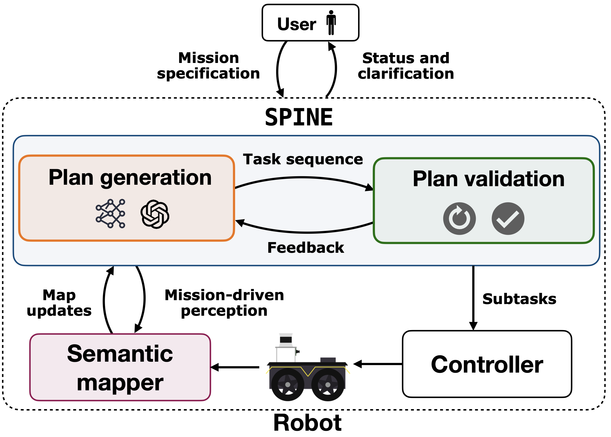

# SPINE

The is the repository for [SPINE: Online Semantic Planning for Missions with Incomplete Natural Language Specifications in Unstructured Environments](https://arxiv.org/abs/2410.03035).

TLDR: SPINE is an LLM-enabled planner designed for missions with incomplete specifications in unstructured environments.


This repository contains the
* the core SPINE framework 
* a ROS wrapper for the clearpath jackal





# Installation 

We provide support for deployment on the Clearpath Jackal via the provided Docker image in [jackal-infrastructure](https://github.com/KumarRobotics/jackal-infrastructure).

# Example

We provide an offline example in [`./scripts/test_exploration.py`](./scripts/test_exploration.py)

```
python scripts/test_spine.py --help
usage: test_spine.py [-h] [--task TASK] [--graph GRAPH] [--init-node INIT_NODE]

options:
  -h, --help            show this help message and exit
  --task TASK
  --graph GRAPH
  --init-node INIT_NODE
```

# Running on the clearpath Jacakl

We provide a launch file compatible with our (Clearpath Jacal autonomy stack](https://github.com/KumarRobotics/dcist_master).

```
roslaunch planner.launch
```


## node info

```
Node [/spine_node]
Publications: 
 * /spine_node/filtered_costmap [nav_msgs/OccupancyGrid]
 * /spine_node/graph [std_msgs/String]
 * /spine_node/graph_viz [visualization_msgs/Marker]
 * /task_labels [std_msgs/String]

Subscriptions: 
 * /move_base/local_costmap/costmap # costmap for building semantic graph
 * /tracker_node/tracks # tracks for semantic graph

Services: 
 * /spine_node/interrupt   # stop a mission
 * /spine_node/mission  # specify a mission
```


```
@article{ravichandran_spine,
  title={SPINE: Online Semantic Planning for Missions with Incomplete Natural Language Specifications in Unstructured Environments}, 
  author={Zachary Ravichandran and Varun Murali and Mariliza Tzes and George J. Pappas and Vijay Kumar},
  year={2025},
  journal={International Conference on Robotics and Automation (ICRA)},
  url={https://arxiv.org/abs/2410.03035}, 
}
```
